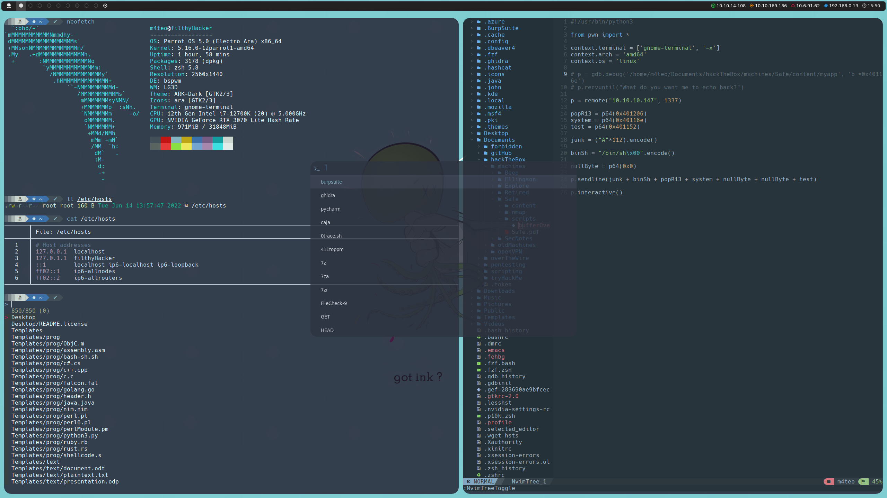

<h1 align="center">ArcticTones</h1>

<p align="center">
  
</p>

ArcticTones is a minimalist Linux setup for Parrot Security Edition. It features an arctic, north-bluish color palette that provides a clean and modern look to your desktop environment. Powered by bspwm, ArcticTones offers an efficient and customizable workflow. It's a perfect choice for those seeking a streamlined and visually appealing Linux setup that combines style and functionality.

## Table of Contents

* [Dependencies](#dependencies)
* [Installation Steps](#installation-steps-parrot-security-edition---53-electro-ara)
* [Configuration Files](#configuration-files)
* [Usage and Shortcuts](#usage-and-shortcuts)

## Dependencies

* [bspwm](https://github.com/baskerville/bspwm)
* [sxhkd](https://github.com/baskerville/sxhkd)
* [feh](https://github.com/derf/feh)
* [picom](https://github.com/ibhagwan/picom)
* [Nerd Fonts](https://github.com/ryanoasis/nerd-fonts)
* [Feather](https://github.com/feathericons/feather)
* [Polybar](https://github.com/polybar/polybar)
* [zsh](https://www.zsh.org/)
* [zsh-autocomplete](https://github.com/marlonrichert/zsh-autocomplete)
* [zsh-autosuggestions](https://github.com/zsh-users/zsh-autosuggestions)
* [zsh-history-substring-search](https://github.com/zsh-users/zsh-history-substring-search)
* [zsh-sudo](https://github.com/ohmyzsh/ohmyzsh)
* [zsh-syntax-highlighting](https://github.com/zsh-users/zsh-syntax-highlighting)
* [Powerlevel10k](https://github.com/romkatv/powerlevel10k)
* [Rofi](https://github.com/davatorium/rofi)
* [Dunst](https://github.com/dunst-project/dunst)
* [NvChad](https://github.com/NvChad/NvChad)
* [Bat](https://github.com/sharkdp/bat)
* [LSD](https://github.com/Peltoche/lsd)
* [fzf](https://github.com/junegunn/fzf)
* [ranger](https://github.com/ranger/ranger)
* [glitchlock](https://github.com/xero/glitchlock)

## Installation Steps (Parrot Security Edition - 5.3 Electro Ara)

__NOTE:__ The installation steps in this guide assume the use of the ``/opt`` directory as the installation location. By default, the ownership of files and directories in ``/opt`` is set to __root__. If you prefer to have ownership of the files as your user account, you have a few options: 

* __Custom Location:__ You can choose any other location where you have full access and control over the files and directories. Simply adjust the commands and paths accordingly to match your chosen location.

* __Individual File Ownership:__ After cloning each repository, you can change the ownership of the files individually. Use the following command as an example to change the ownership of a file or directory:

```
sudo chown -R your-username:your-username /path/to/file-or-directory
```

Replace ``your-username`` with your actual username and ``/path/to/file-or-directory`` with the specific path.

* __Full Ownership of /opt:__ Alternatively, you can choose to take full ownership of the ``/opt`` directory. This allows you to have complete control over the files and directories within ``/opt``.

To take full ownership of ``/opt``, run the following command:

```
sudo chown -R your-username:your-username /opt
```

Replace ``your-username`` with your actual username.

Choose the option that best suits your preference, and adjust the ownership accordingly for each repository or the chosen directory.

1. Configuration Files

```
sudo parrot-upgrade
cd /opt
git clone https://github.com/MateoNitro550/ArcticTones
```

2. bspwm

```
sudo apt install bspwm libxcb-xinerama0-dev libxcb-icccm4-dev libxcb-randr0-dev libxcb-util0-dev libxcb-ewmh-dev libxcb-keysyms1-dev libxcb-shape0-dev
git clone https://github.com/baskerville/bspwm.git
cd bspwm && make && sudo make install
mkdir -p ~/.config/bspwm
mv /opt/ArcticTones/bspwmrc ~/.config/bspwm
```

3. sxhkd

```
cd /opt
git clone https://github.com/baskerville/sxhkd.git
cd sxhkd && make && sudo make install
mkdir -p ~/.config/sxhkd
mv /opt/ArcticTones/sxhkdrc ~/.config/sxhkd
```

4. feh

```
sudo apt install feh
mv /opt/ArcticTones/octopus.png ~/Pictures
```

5. picom

```
cd /opt
sudo apt install libxext-dev libxcb1-dev libxcb-damage0-dev libxcb-dpms0-dev libxcb-xfixes0-dev libxcb-shape0-dev libxcb-render-util0-dev libxcb-render0-dev libxcb-randr0-dev libxcb-composite0-dev libxcb-image0-dev libxcb-present-dev libxcb-glx0-dev libpixman-1-dev libdbus-1-dev libconfig-dev libgl-dev libegl-dev libpcre2-dev libpcre3-dev libevdev-dev uthash-dev libev-dev libx11-xcb-dev meson
git clone https://github.com/ibhagwan/picom
cd picom
git submodule update --init --recursive
meson setup --buildtype=release . build
ninja -C build
sudo ninja -C build install
mkdir -p ~/.config/picom
mv /opt/ArcticTones/picom.conf ~/.config/picom
```

6. Nerd Fonts && Feather

```
sudo unzip /opt/ArcticTones/Hack.zip -d /usr/local/share/fonts
rm -rf /opt/ArcticTones/Hack.zip
sudo mv /opt/ArcticTones/feather.ttf /usr/local/share/fonts
fc-cache -v
```

7. Terminal

Open a terminal window and right-click within it. Then, select "__Profiles__" from the context menu and choose "__Profile Preferences__."

In the "__General__" tab, uncheck the "__Use the system fixed width font__" box and modify the font to "__Hack NF Regular__." Uncheck the "__Show menubar by default in new terminals__" box to declutter the interface. Change the cursor shape to "__I-Beam__" for better visibility and precision. You may also choose to disable the "__Terminal bell__" if you find audible alerts distracting.

<p align="center">
  
</p>

Under the "__Colors__" tab, modify the "__Text color__" to #FFFFFF for a white text appearance. Update the color palette as follows, starting from the first row, left to right:

* #2E3436
* #CC0000
* #88C0D0
* #C4A000
* #3465A4
* #75507B
* #06989A
* #D3D7CF

For the second row, from left to right:

* #2E3440
* #EF2929
* #88C0D0
* #FCE94F
* #729FCF
* #AD7FA8
* #34E2E2
* #EEEEEC

<p align="center">
  
</p>

Under the "__Scrolling__" tab, set the "__Scrollbar__" option to "__Disabled__."

<p align="center">
  
</p>

8. Polybar

```
sudo apt install build-essential git cmake cmake-data pkg-config python3-sphinx python3-packaging libuv1-dev libcairo2-dev libxcb1-dev libxcb-util0-dev libxcb-randr0-dev libxcb-composite0-dev python3-xcbgen xcb-proto libxcb-image0-dev libxcb-ewmh-dev libxcb-icccm4-dev
sudo apt install libxcb-xkb-dev libxcb-xrm-dev libxcb-cursor-dev libasound2-dev libpulse-dev i3-wm libjsoncpp-dev libmpdclient-dev libcurl4-openssl-dev libnl-genl-3-dev
cd /opt
git clone --recursive https://github.com/polybar/polybar
cd polybar
mkdir build
cd build
cmake ..
make -j$(nproc)
sudo make install
rm -rf ~/.config/polybar
mv /opt/ArcticTones/polybar ~/.config
chmod -R u+x ~/.config/polybar/modules/*.sh
```

9. zsh

```
sudo apt install zsh
sudo usermod --shell /usr/bin/zsh your-username
sudo usermod --shell /usr/bin/zsh root
```

Replace ``your-username`` with your actual username.

```
mv /opt/ArcticTones/zshrc ~/.zshrc
sudo ln -sf ~/.zshrc /root/.zshrc
```

10. zsh plugins

zsh-autocomplete

```
sudo git clone https://github.com/marlonrichert/zsh-autocomplete /usr/share/zsh-autocomplete
```

zsh-autosuggestions

```
sudo git clone https://github.com/zsh-users/zsh-autosuggestions /usr/share/zsh-autosuggestions
```

zsh-history-substring-search

```
sudo git clone https://github.com/zsh-users/zsh-history-substring-search /usr/share/zsh-history-substring-search
```

zsh-sudo

```
sudo git clone -n --depth=1 --filter=tree:0 https://github.com/ohmyzsh/ohmyzsh /usr/share/zsh-sudo
cd /usr/share/zsh-sudo
sudo git sparse-checkout set --no-cone plugins/sudo
sudo git checkout
sudo mv plugins/sudo/* .; sudo rm -rf plugins
```

zsh-syntax-highlighting 

```
sudo git clone https://github.com/zsh-users/zsh-syntax-highlighting /usr/share/zsh-syntax-highlighting
```

To address the ``zsh compinit: insecure files`` error related to the zsh plugins, you can resolve it by executing the following commands:

```
sudo chmod -R 755 /usr/local/share/zsh/site-functions
sudo chown -R root:root /usr/local/share/zsh/site-functions
```

By performing these steps, you ensure that the files within the ``site-functions`` directory have secure permissions and are owned by the root user. This should resolve the insecure files issue and eliminate the ``zsh compinit: insecure files`` error. 

11. Powerlevel10k

```
cd /opt
git clone --depth=1 https://github.com/romkatv/powerlevel10k.git
mv /opt/ArcticTones/p10k.zsh ~/.p10k.zsh
sudo ln -sf ~/.p10k.zsh /root/.p10k.zsh
```

12. Rofi

```
sudo apt install rofi
mv /opt/ArcticTones/rofi ~/.config/rofi
```

13. Dunst

```
sudo apt install dunst
mkdir -p ~/.config/dunst
mv /opt/ArcticTones/dunstrc ~/.config/dunst
```

14. NvChad

Download the [latest stable release](https://github.com/neovim/neovim/releases/tag/stable) of __Neovim__ by visiting their GitHub repository. Look for the __nvim.appimage__ file and download it to your computer.

Open the terminal and execute the following commands to rename the downloaded ``nvim.appimage`` file, set the appropriate permissions, and move it to the /usr/bin directory:

```
mv nvim.appimage nvim
chmod 755 nvim
sudo chown root:root nvim
sudo mv nvim /usr/bin
```

Once __Neovim__ is installed, you can proceed with installing __NvChad__. Execute the following commands in the terminal to remove any existing __Neovim__ configurations and clone the __NvChad__ repository:

```
rm -rf ~/.config/nvim
rm -rf ~/.local/share/nvim
git clone https://github.com/NvChad/NvChad ~/.config/nvim --depth 1 && nvim
```

When prompted with the message "__Do you want to install example custom config?__", type "__y__" and press Enter to install the example custom config. Wait for the installation to complete, and then you can start using __NvChad__ with __Neovim__.

15. Bat

Download the [latest release](https://github.com/sharkdp/bat/releases) of __Bat__ by visiting their GitHub repository. Look for the appropriate __bat\_...\_amd64.deb__ file and download it to your computer.

```
sudo dpkg -i bat_..._amd64.deb
rm -rf bat_..._amd64.deb
mkdir -p ~/.config/bat
echo '--theme="Nord"' > ~/.config/bat/config
```

16. LSD

Download the [latest release](https://github.com/lsd-rs/lsd/releases) of __LSD__ by visiting their GitHub repository. Look for the appropriate __lsd\_...\_amd64.deb__ file and download it to your computer.

```
sudo dpkg -i lsd_..._amd64.deb
rm -rf lsd_..._amd64.deb
```

17. fzf

For your __user account__:

```
git clone --depth 1 https://github.com/junegunn/fzf.git ~/.fzf
~/.fzf/install
```

For the __root__ user:

```
sudo git clone --depth 1 https://github.com/junegunn/fzf.git /root/.fzf
sudo /root/.fzf/install
```

Make sure to answer "__Yes__" to the prompts during the installation to enable __fuzzy auto-completion__, __key bindings__, and __update the shell configuration files__.

18. ranger

```
sudo apt install ranger
```

19. glitchlock

To install __glitchlock__, you'll need to first install the required dependencies. We will start by building __i3lock-color__ from source.

```
cd /opt
sudo apt install autoconf gcc make pkg-config libpam0g-dev libcairo2-dev libfontconfig1-dev libxcb-composite0-dev libev-dev libx11-xcb-dev libxcb-xkb-dev libxcb-xinerama0-dev libxcb-randr0-dev libxcb-image0-dev libxcb-util0-dev libxcb-xrm-dev libxkbcommon-dev libxkbcommon-x11-dev libjpeg-dev
git clone https://github.com/Raymo111/i3lock-color.git
./i3lock-color/install-i3lock-color.sh
cd /opt
rm -rf i3lock-color
```

Once __i3lock-color__ is installed, we can proceed with installing glitchlock. Run the following commands in the terminal:

```
sudo apt install scrot imagemagick 
git clone https://github.com/xero/glitchlock
```

20. Autodestruction

```
rm -rf /opt/ArcticTones
```
21. Migrating to bspwm

Now it's time to migrate to __bspwm__. To do this, we first need to log out of our current session. You can log out manually from the menu or by using the following command in the terminal:

```
kill -9 -1
```

Once you reach the login screen, you will notice a white dot representing the available desktop environments. Click on the white dot and select __bspwm__ from the list of available environments.

<p align="center">
  
</p>

After logging back in, don't panic if you see a black screen. This is expected behavior. In the [next section](https://github.com/MateoNitro550/ArcticTones#configuration-files), we will modify a configuration file to set up a wallpaper and customize the appearance of the desktop. 

From this point onward, we will be using the sxhkd keybindings to interact with our bspwm environment. To learn more about the available keybindings and shortcuts, please refer to the [Usage and Shortcuts](https://github.com/MateoNitro550/ArcticTones#usage-and-shortcuts) section.


## Configuration Files

Some text...

## Usage and Shortcuts

Some text...
